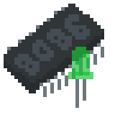
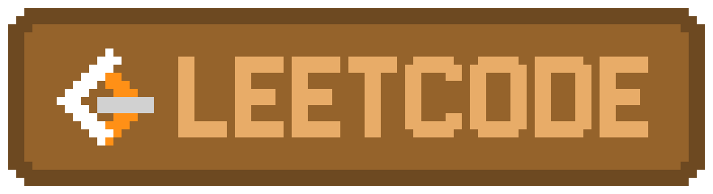

Hello, my name is Daniil. I want to be a programmer!

## Skills
-  **Embedded and low-level: C, ASM (flat assembler for x86-16, x86-32)**
-  Android development: Kotlin (Compose), Java
-  Desktop development: Linux API, WinAPI, macOS (Swift 4 + SwiftUI)
-  Games!: Clickteam Fusion 2.5, GameMaker (ex. GMS 2), **Godot**
-  *And simple web development: Vue.JS, FastAPI*
-  *Discord bots with Discord.JS*

By languages (most-less used):
1. ** C,  ASM**
2. ** Kotlin,  Java**
3.  Swift
4.  Python
5. * C++,  JavaScript (node.js too)*
6. * GDScript,  C#,  GML (GameMaker Language)*

## Featured projects
- As an open-source software:
  - : [tioo](https://github.com/RedmanEXE/tioo) - simple microkernel for MCUs
  - : [lodit!](https://github.com/RedmanEXE/lodit) - framework, that can be used to develop universal bytecode for x86-16 and x86-32 architectures
  -  : [cf-extensions](https://github.com/RedmanEXE/cf-extensions) - extensions for Clickteam Fusion 2.5
- Anything else:
  -  : [RM](https://play.google.com/store/apps/details?id=dev.rexe.redm) - comics (or manga) reader with big amount of settings
  - : [GJ API: RMod](https://gamejolt.com/games/gj_api_ctf25_rmod/685662) - modded GameJolt API object for CF2.5

## Links

  
  
  
  
  

